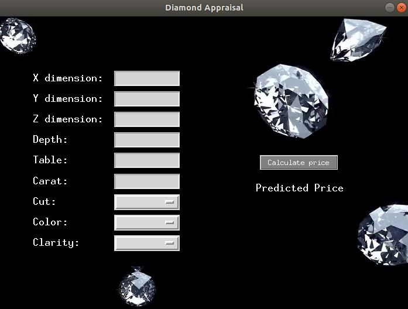
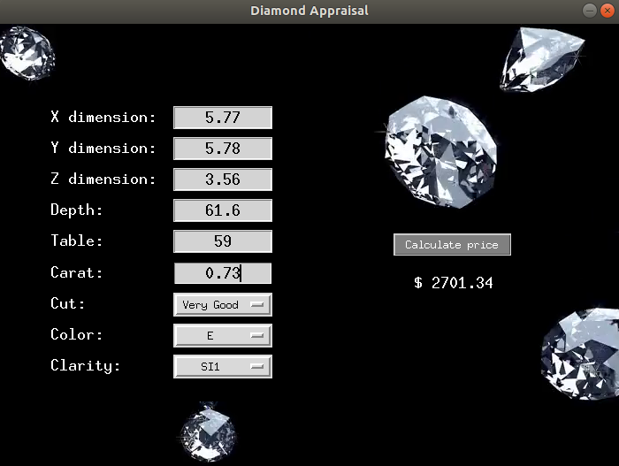
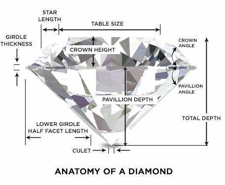

# Diamonds Appraisal

## :boom: Diamond Price Assessment GUI

This project's idea came from a private kaggle competition. The main goal was to create the best machine learning model at predicting any diamond's price.

## :computer: Technology stack
Written in python 3. Main modules:

**Scikit-Learn** -> Model training and prediction, RandomForestRegressor(n_estimators=512, max_depth=16)

**Tkinter** -> Graphical User Interface (GUI)

## :wrench: Configuration

Install python 3.7 and mandatory dependencies listed in the requirements file.

If you are using the anaconda distribution. Run the following command to create a new environment named "diamond"

```
conda env create -f requirements.yml
```

**Note:** Environment managers differ from one another. It's strongly recommended to check its documentation.

## :snake: Running the GUI
Before running the GUI for the first time, you must train the model and save it as a binary file. This training is a one time task, once trained the model is loaded from the binary file. Train your model by navigating to where the rep was downloaded and type `python packages/Model/model.py` in your terminal window. Typically, the training process takes about 3 minutes but it is subjected to your system performance (RAM, cores, etc)

This GUI can run any other model that was trained using the diamonds data set found at kaggle.

### Running GUI using a pre-installed model 
Navigate to where the rep was downloaded and type `python main.py` on your terminal. This will run the main.py script which automatically opens the GUI and loads the Random Forest model trained in the previous step.

<p align="center">
  
</p>

### Running GUI using another model
Any model trained using the diamonds data set can be used to run the GUI. Custom models should be placed at the following path Diamonds_Appraisal/data/model_binary/my_custom_model.pkl

Run custom models by typing the following line of code on your terminal: `python main.py my_custom_model.pkl`

### Predicting prices
Prices are calculated using all 9 entries at the left part of the window. All entries should be filled out. First 6 entries can only take float or integer values, while the last 3 are drop-down lists. Click on the "Calculate price" button to update the "Predicted Price" label and show the price prediction.

<p align="center">
  
</p>

## :information_source: Data set info

<p align="center">
  
</p>

Comprised by almost 54.000 registries. Data set features are the following:

**price** price in US dollars (min: $326 - max: $18,823)

**carat** weight of the diamond (min: 0.2 - max: 5.01)

**cut** quality of the cut (Fair (lowest), Good, Very Good, Premium, Ideal (highest))

**color** diamond colour, from J (worst) to D (best)

**clarity** a measurement of how clear the diamond is (I1 (worst), SI2, SI1, VS2, VS1, VVS2, VVS1, IF (best))

**x** length in mm (min: 0 - max: 10.74)

**y** width in mm (min: 0 - max: 58.9)

**z** depth in mm (min: 0 - max: 31.8)

**depth** total depth percentage = z / mean(x, y) = 2 * z / (x + y) (min: 43 - max: 79)

**table** width of top of diamond relative to widest point (min: 43 - max: 95)

## :file_folder: Folder structure
```
└── Diamonds_Appraisal
    ├── .gitignore
    ├── requirements.txt
    ├── requirements.yml
    ├── README.md
    ├── main.py
    ├── notebooks
    │   └── Pipeline.ipynb
    ├── packages
    │   ├── GUI
    │   │   └── GUI.py
    │   └── Model
    │   │   └── model.py
    └── data
        ├── raw
        │   ├── diamonds.csv
        │   ├── diamonds_test.csv
        │   └── diamonds_train.csv
        └── model_binary
            └── RandomForest.pkl
```

## :interrobang: Custom models
Take a look at the Pipeline.ipynb notebook or the model.py script to get a general idea. These two files have all necessary steps to create, test, enhance and save your new modules.

## :love_letter: Contact info
Doubts? Advice?  Drop me a line! :smirk:
